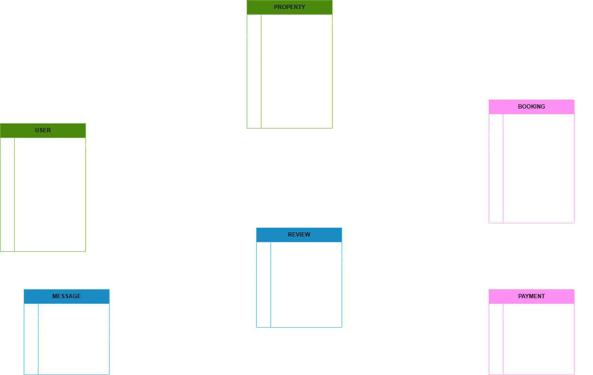

# Airbnb Clone Database Requirements

## 📌 Introduction

This document outlines the database design for the Airbnb Clone project. It specifies the core entities, their attributes, relationships, constraints, and indexing requirements, as well as the ER diagram used for visual representation.

---

## 🗃️ Entities

### 1. User

- **Primary Key:** user_id (UUID)
- **Attributes:**
  - first_name: VARCHAR, NOT NULL
  - last_name: VARCHAR, NOT NULL
  - email: VARCHAR, UNIQUE, NOT NULL
  - password_hash: VARCHAR, NOT NULL
  - phone_number: VARCHAR, NULL
  - role: ENUM (guest, host, admin), NOT NULL
  - created_at: TIMESTAMP, DEFAULT CURRENT_TIMESTAMP

### 2. Property

- **Primary Key:** property_id (UUID)
- **Foreign Key:** host_id (User.user_id)
- **Attributes:**
  - name: VARCHAR, NOT NULL
  - description: TEXT, NOT NULL
  - location: VARCHAR, NOT NULL
  - pricepernight: DECIMAL, NOT NULL
  - created_at: TIMESTAMP, DEFAULT CURRENT_TIMESTAMP
  - updated_at: TIMESTAMP, ON UPDATE CURRENT_TIMESTAMP

### 3. Booking

- **Primary Key:** booking_id (UUID)
- **Foreign Keys:**
  - property_id (Property.property_id)
  - user_id (User.user_id)
- **Attributes:**
  - start_date: DATE, NOT NULL
  - end_date: DATE, NOT NULL
  - total_price: DECIMAL, NOT NULL
  - status: ENUM (pending, confirmed, canceled), NOT NULL
  - created_at: TIMESTAMP, DEFAULT CURRENT_TIMESTAMP

### 4. Payment

- **Primary Key:** payment_id (UUID)
- **Foreign Key:** booking_id (Booking.booking_id)
- **Attributes:**
  - amount: DECIMAL, NOT NULL
  - payment_date: TIMESTAMP, DEFAULT CURRENT_TIMESTAMP
  - payment_method: ENUM (credit_card, paypal, stripe), NOT NULL

### 5. Review

- **Primary Key:** review_id (UUID)
- **Foreign Keys:**
  - property_id (Property.property_id)
  - user_id (User.user_id)
- **Attributes:**
  - rating: INTEGER (1-5), NOT NULL
  - comment: TEXT, NOT NULL
  - created_at: TIMESTAMP, DEFAULT CURRENT_TIMESTAMP

### 6. Message

- **Primary Key:** message_id (UUID)
- **Foreign Keys:**
  - sender_id (User.user_id)
  - recipient_id (User.user_id)
- **Attributes:**
  - message_body: TEXT, NOT NULL
  - sent_at: TIMESTAMP, DEFAULT CURRENT_TIMESTAMP

---

## 🔗 Relationships

- **User to Property:** One-to-Many (A user can list many properties)  
- **User to Booking:** One-to-Many (A user can make many bookings)  
- **Property to Booking:** One-to-Many (A property can have many bookings)  
- **Booking to Payment:** One-to-One (Each booking has one payment)  
- **User to Review:** One-to-Many (A user can leave many reviews)  
- **Property to Review:** One-to-Many (A property can have many reviews)  
- **User to Message:** One-to-Many (A user can send multiple messages)  

---

## 🚧 Constraints

- **User Table:**  
  - Unique constraint on `email`.  
  - Non-null constraints on essential fields.  

- **Property Table:**  
  - Foreign key constraint on `host_id`.  
  - Non-null constraints on essential attributes.  

- **Booking Table:**  
  - Foreign key constraints on `property_id` and `user_id`.  
  - `status` must be one of `pending`, `confirmed`, `canceled`.  

- **Payment Table:**  
  - Foreign key constraint on `booking_id`, ensuring each payment is tied to a valid booking.  

- **Review Table:**  
  - Constraints on `rating` (values between 1 and 5).  
  - Foreign key constraints on `property_id` and `user_id`.  

- **Message Table:**  
  - Foreign key constraints on `sender_id` and `recipient_id`.  

---

## 🗃️ Indexing

- **Primary Keys:** Automatically indexed.
- **Additional Indexes:**  
  - `email` in the **User** table.  
  - `property_id` in the **Property** and **Booking** tables.  
  - `booking_id` in the **Booking** and **Payment** tables.  

---

## 🗺️ ER Diagram Reference

Below is the Entity-Relationship Diagram (ERD) for the Airbnb Clone database:

